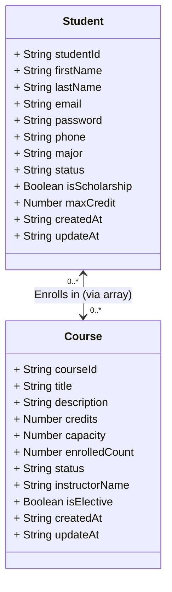

# 🎓 Course Registration API (JSON Storage Version)

A robust backend RESTful API for a university course registration system. Built with **NestJS** and uses a **JSON file-based storage system** (`database.json`), running natively without any external database dependencies.

## 🚀 Getting Started

Follow these instructions to set up and run the project on your local machine.

### Prerequisites
- [Node.js](https://nodejs.org/) (v16 or higher)
- npm (Node Package Manager)

### Installation
1. Clone the repository:
   ```bash
   git clone https://github.com/AsiaE14/nestjs-final-project-naja.git
   ```
2. Navigate to the project directory and install dependencies:
   ```bash
   npm install
   ```

### Running the Application
Start the development server:
```bash
npm run start:dev
```
The server will be running on `http://localhost:3000`. 
*Note: If `database.json` does not exist, the system will automatically generate it upon the first API request.*

---

## 🔌 API Documentation (Swagger)

This project includes automatically generated API documentation using Swagger UI. You can explore the endpoints, view schemas, and test the API directly from your browser.

- **Swagger UI URL:** [http://localhost:3000/api](http://localhost:3000/api)

---

## 🧱 Data Dictionary (JSON Schema)

### 1. `Student` Object
| Key Name | Data Type | Description |
| :--- | :--- | :--- |
| `studentId` | String | 8-digit student ID (Unique ID) |
| `firstName` | String | First name |
| `lastName` | String | Last name |
| `email` | String | Contact email address |
| `password` | String | Password for login authentication |
| `phone` | String | Contact phone number |
| `major` | String | Student's major or field of study |
| `status` | String | Enrollment status (`ACTIVE` or `INACTIVE`) |
| `isScholarship`| Boolean | Scholarship status (true/false) |
| `maxCredit` | Number | Maximum credits allowed for registration |
| `createdAt` | String | ISO Timestamp of record creation |
| `updateAt` | String | ISO Timestamp of record update |
| `courses` | Array | Array of enrolled `Course` objects |

### 2. `Course` Object
| Key Name | Data Type | Description |
| :--- | :--- | :--- |
| `courseId` | String | Course code or ID (Unique ID) |
| `title` | String | Course title |
| `description` | String | Course description (Optional) |
| `credits` | Number | Number of credits |
| `capacity` | Number | Maximum student capacity |
| `enrolledCount`| Number | Current number of enrolled students |
| `status` | String | Course status (`OPEN`, `CLOSED`, `CANCELLED`) |
| `instructorName`| String | Instructor name |
| `isElective` | Boolean | Elective course indicator |
| `createdAt` | String | ISO Timestamp of record creation |
| `updateAt` | String | ISO Timestamp of record update |

---

## 📊 UML Class Diagram

